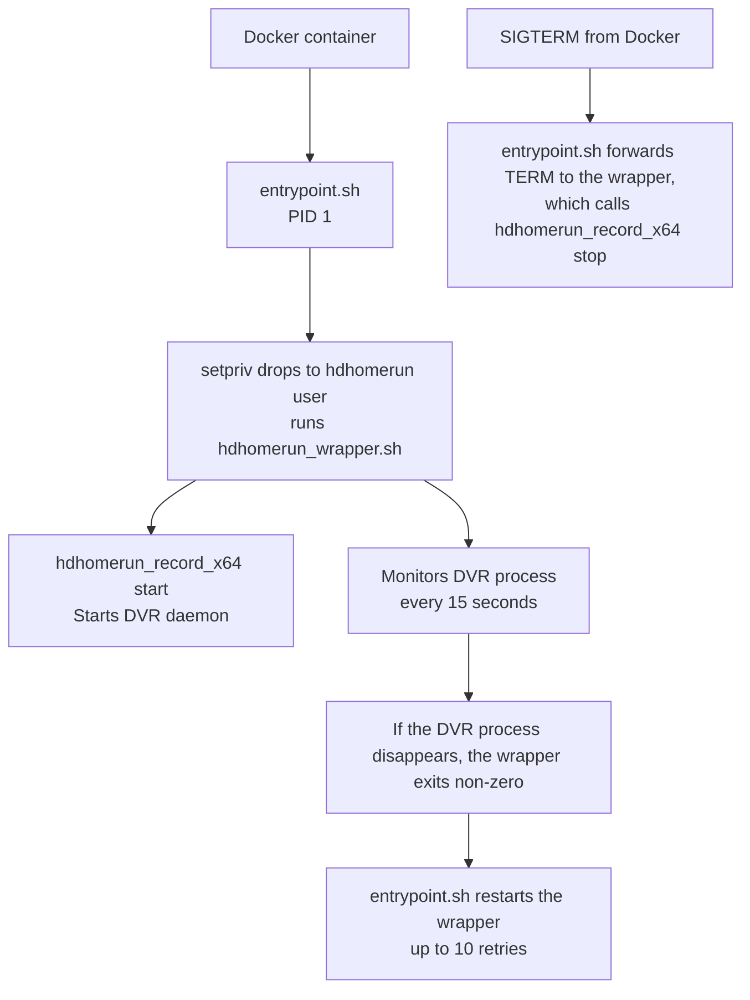

# docker-hdhomerundvr

Docker container for the [HDHomeRun DVR Server](https://forum.silicondust.com/forum/viewtopic.php?f=126&t=20613) by SiliconDust.

**HDHomeRun DVR Server version:** 20250815  
**Base image:** debian:bookworm-slim

---

## Features

- Runs the HDHomeRun DVR recording engine inside a Docker container
- `entrypoint.sh` keeps the process alive — auto-restarts if the DVR daemon crashes (up to 10 retries)
- Container-level `restart: unless-stopped` policy recovers from container failures
- Minimal image (no Python/supervisord) — the DVR daemon runs as an unprivileged user via `setpriv`
- Timezone configurable via the `TZ` environment variable
- Host networking for full HDHomeRun device discovery (UDP broadcast)

---

## Requirements

- A working HDHomeRun network tuner with up-to-date firmware (see below)
- Docker and Docker Compose installed on the host

---

## Quick Start

### Option A: Docker Hub

Use the published image from Docker Hub:

https://hub.docker.com/repository/docker/yoshiofthewire/hdhomerundvr/general

### Option B: Build Locally

```bash
# 1. Clone the repository
git clone https://github.com/Yoshiofthewire/docker-hdhomerundvr.git
cd docker-hdhomerundvr

# 2. Edit docker-compose.yml and set your recordings path and timezone
#    volumes:
#      - /your/recordings/path:/hdhomerun
#    environment:
#      - TZ=America/New_York

# 3. Build and start
docker compose up -d --build
```

---

## Configuration

### Environment Variables

| Environment Variable | Default | Description |
|---|---|---|
| `TZ` | `UTC` | Timezone (e.g. `America/New_York`, `Europe/London`) |

### Volumes

| Container Path | Description |
|---|---|
| `/hdhomerun` | Recording output directory — map this to your storage path |

### Ports

| Port | Protocol | Description |
|---|---|---|
| `65001` | UDP | HDHomeRun discovery |
| `65002` | TCP | DVR control/streaming |

> **Note:** `network_mode: host` is used in `docker-compose.yml` so that UDP broadcast device discovery works correctly. In host mode, the `ports` mapping is bypassed, so the ports above are documentation only.

---

## Updating the HDHomeRun Firmware

Before the first install or when updating firmware:

1. Install the HDHomeRun Windows or Mac application.
2. When prompted to install the DVR server component, select **Don't Install**.
3. You will be prompted to configure the tuner after setup completes.
4. Re-run the tuner setup — this will update the firmware.
5. You may need to re-scan channels after the firmware update.

---

## CI / Release Workflow

This repository includes a GitHub Actions workflow at `.github/workflows/docker-release.yml`.

On each push to `main` or manual dispatch, the workflow:

- computes an auto-incrementing release version from the Git commit count
- builds the Docker image
- tags and pushes the image to Docker Hub
- creates a Git tag like `v1.0.<commit_count>`
- creates a GitHub release for the tag

To allow Docker image publishing, configure these repository secrets:

- `DOCKERHUB_USERNAME`
- `DOCKERHUB_TOKEN`

The built image is published as:

- `docker.io/yoshiofthewire/hdhomerundvr:1.0.<commit_count>`
- `docker.io/yoshiofthewire/hdhomerundvr:latest`

---

## How It Works



- `entrypoint.sh` runs as PID 1 in the foreground, preventing spurious container exits.
- It uses `setpriv` to drop from root to the unprivileged `hdhomerun` user before running `hdhomerun_wrapper.sh`, which wraps the DVR daemon (which forks to the background) and stays alive to monitor it.
- If the DVR process disappears, the wrapper exits with a non-zero code so `entrypoint.sh` restarts it (up to 10 retries).
- `SIGTERM` from Docker is caught cleanly by `entrypoint.sh`, which forwards it to the wrapper — the wrapper calls `hdhomerun_record_x64 stop` before exiting.

---

## License

GPL v2.0
